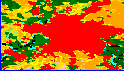
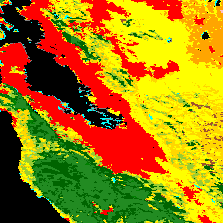
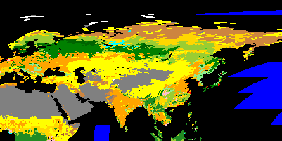
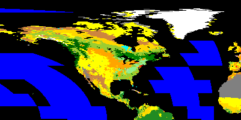
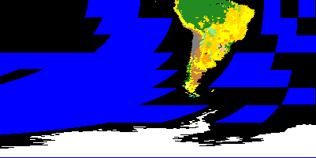

# earth-to-gridMap

The code utilizes Google Earth Engine to fetch land cover data for a specific region. It then processes this data to generate an image and a plot showcasing the distribution of different land cover types within the area. The results are finally saved to a CSV file. Let me know if you have any other questions.

## Getting Started
You can also quickly try it out here: 
https://colab.research.google.com/drive/1nfuhsWhklhEm3aBt4oTeSfsfRPGNv7g6?usp=sharing

1. select one of the predefined regions or define your own region
   - make sure the region has a positive area!!
2. adapt the resolution size. The API has a limit of 262144 pixels.
3. run the code, with image, plot or csv output.

## sample output

# images in media folder

## Berlin, Germany

## California

## Northern East Hemisphere

## Northern West Hemisphere

## Southern East Hemisphere

## Southern West Hemisphere
